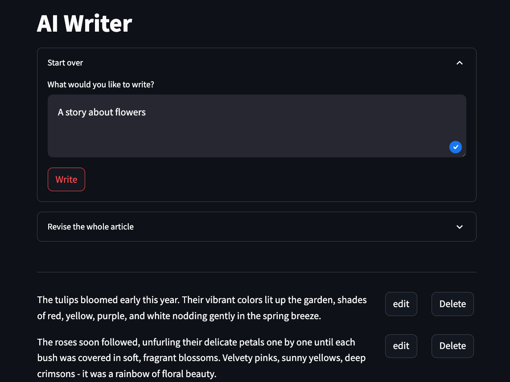
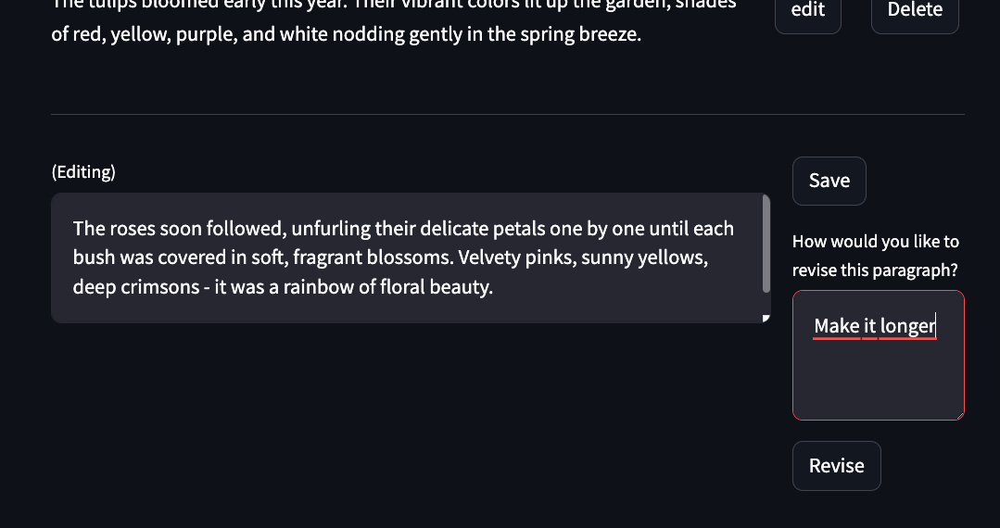
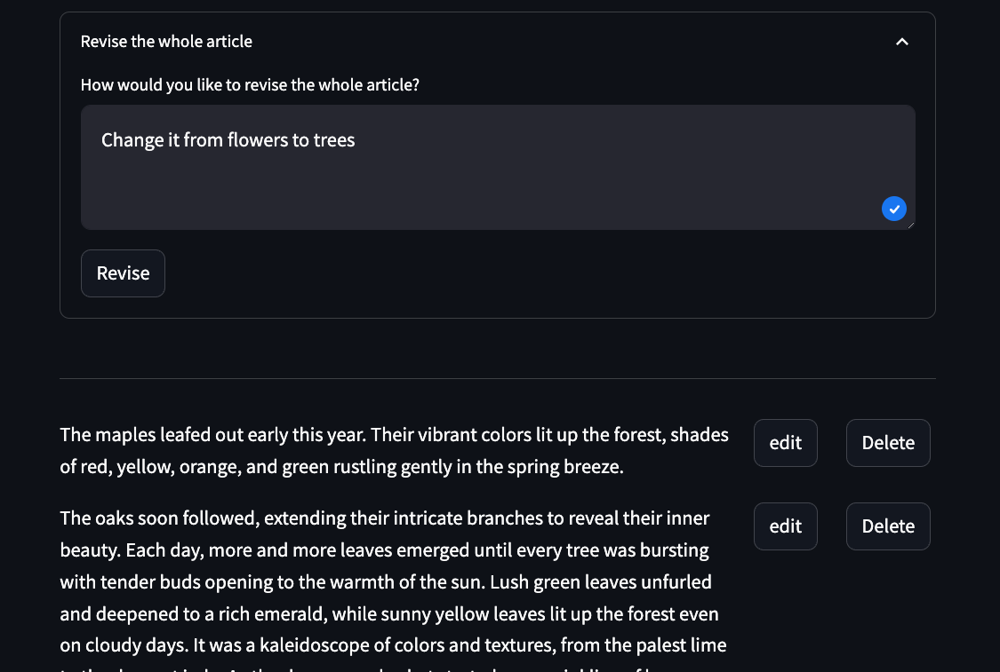

 # AI Writer

This is a Streamlit application that allows users to generate and iteratively revise AI-written articles.

## Functionality

The application has the following functionality:

- Users can provide a prompt to have the AI generate an initial article draft. The generated text is split into paragraphs.



- The drafted article paragraphs are displayed in a list. Users can click on each paragraph to edit it in a textarea. 

- Below each paragraph textarea is a "Revise" button. Users can provide revise instructions and click this to have the AI revise just that paragraph.


- There is an option to provide revise instructions for the entire article, which will invoke the AI to revise all paragraphs.



- The edited article can be copied out of a final textarea field.


## Setup

Requirements:

- Python 3
- An AWS account with Amazon Bedrock access

```
pip install -r requirements.txt
```

Start the application:

```
streamlit run main.py --server.port 8080
```

Open a browser and navigate to http://localhost:8080 to get started.


## Contributing

See [CONTRIBUTING](CONTRIBUTING.md) for more infromation

## License

See [LICENSE](LICENSE)
